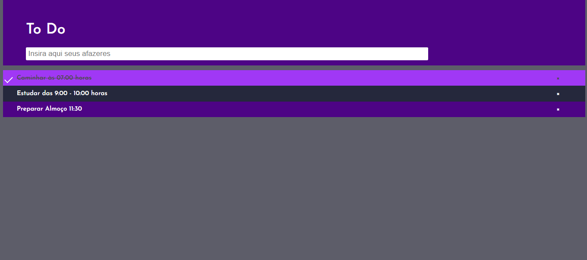
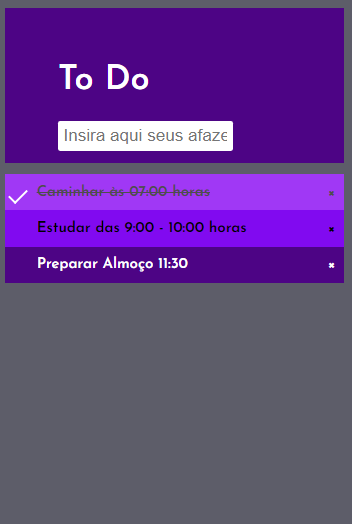

# Desafio Seed: Lista To Do

## Tabela de conteúdo

- [Visão Geral](#Visão-Geral)
  - [Desafio](#O-desafio)
  - [Imagens da solução](#imagens-da-solução)
  - [Links](#links)
  - [Tecnologias](#Construido-com)
  - [Autores](#autores)

## Visão Geral
## O desafio:
Os usuários devem ser capazes de:

- Veja o layout ideal para o aplicativo, dependendo do tamanho da tela do dispositivo ✔
- Ver estados de foco para todos os elementos interativos na página (?)
- Adicionar novos elementos à lista ✔
- Marcar todos como completos ✔
- Excluir tarefas da lista
- Filtrar por todos / ativos / completos todos X
- Limpar todas as tarefas concluídas X
- Alternar entre os modos claro e escuro X
- ** Bônus **: arraste e solte para reordenar os itens da lista X

### imagens da solução

### Construido com:
HTML, CSS e JavaScript

## Autores

- Linkedin - [Jéssica Leal](https://www.linkedin.com/in/j%C3%A9ssica-leal-65bab0124/)
- Instagram - [@jszylw](https://www.instagram.com/jszylw/)
 

- Linkedin - [Mateus Feliph](https://www.linkedin.com/in/mateus-feliph-2078951b3/)
- Instagram - [@Feliph_ventura](https://www.instagram.com/Feliph_ventura/)
